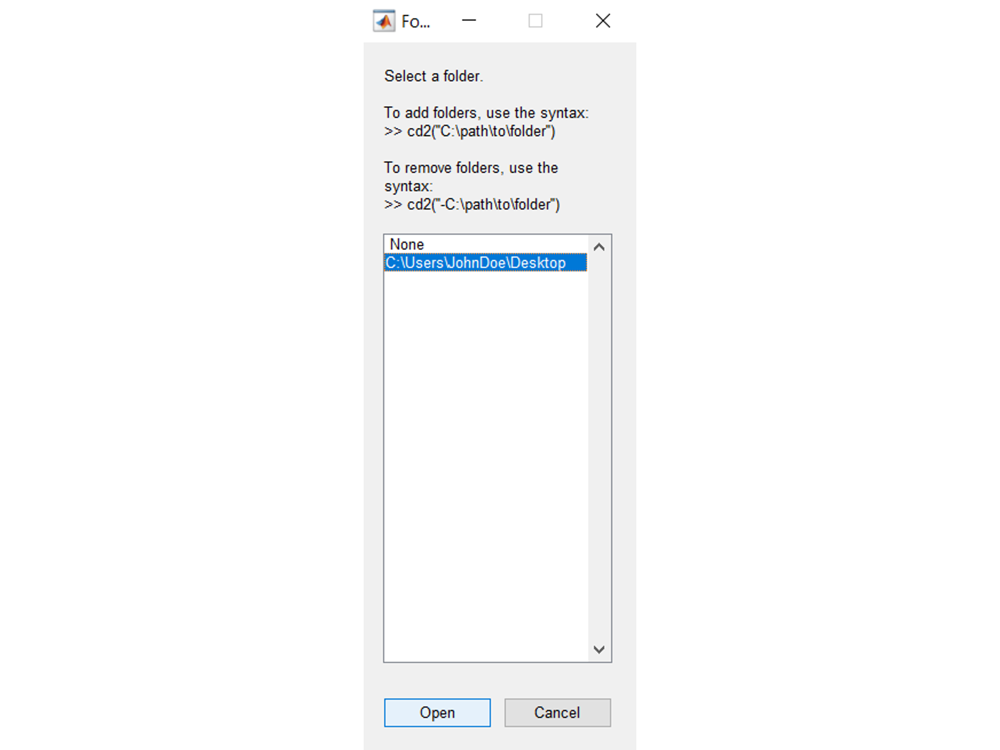

# Why **`cd2`**?
The base MATLAB function `cd` requires the user to input a full search path name in order to change the folder, which can be quite tedious if you switch folders frequently.

In contrast, the `cd2` function allows users to change the current folder by selecting from a dropdown menu of their favorite folders.

Simply add folders to the list of favorites **one time**, and then you won't ever have to manually type the folder names again!


## How to install
1. Download the repository as a zip file and save the contents somewhere on your computer. 

2. Use the `pathtool` function to add the `cd2` folder to the permanent search path.

## Documentation
### Add a folder to the list of favorites
```matlab
>> cd2('C:\Users\JohnDoe\Desktop')
```

### Change the current folder
Calling the `cd2` function without any arguments will open the dropdown list.
```matlab
>> cd2
```



Choose a folder and then click "Open". This will update the current folder to your selection

### Adding multiple folders
You can add multiple folders at once by passing a cell vector of character strings as the optional input:

```matlab
>> cd2({'C:\Users\JohnDoe\Research\Publications',...
        'C:\Program Files\MATLAB',...
        'C:\Users\JohnDoe\Downlods'})
```

### Removing folders
If you incorrectly added a folder, misspelled a folder name, or simply want to remove a folder from the list, you can do so by including a hyphen before the path name when calling the function:

```matlab
% Remove a folder with a misspelled name
>> cd2('-C:\Users\JohnDoe\Downlods')

% Add the folder back using the correct spelling
>> cd2('C:\Users\JohnDoe\Downloads')
```

